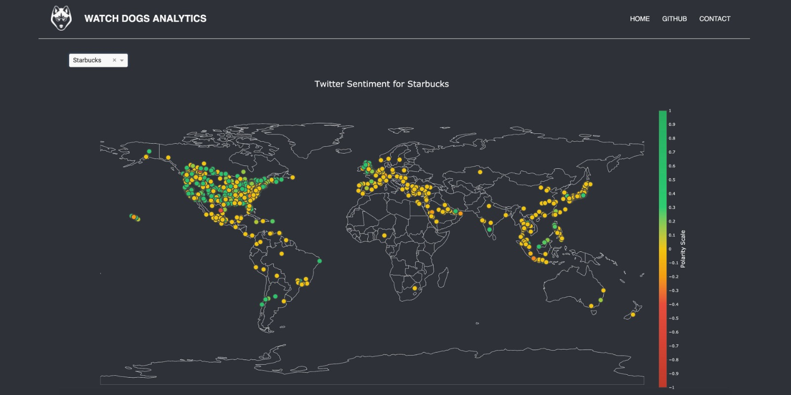
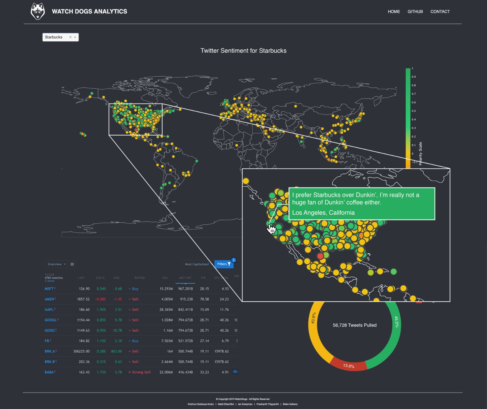
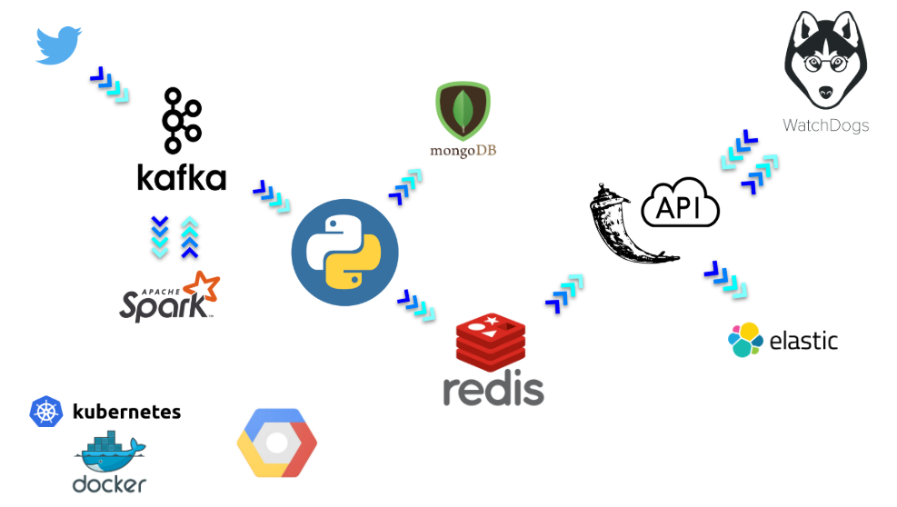
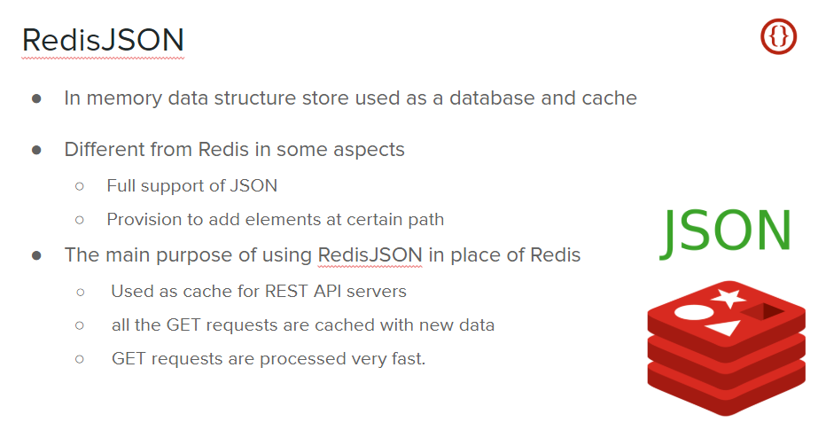

# WatchDogs_StockMarketAnalysis
## Repositories Owners:

Kafka & Spark & Mongodb : Prashanth Thipparthi  
WatchDogs_Mongo_wrapper & Database Populator & ELK_Docker : Krishna Chaitanya Kodur  
WatchDogs_APIServer : Blake Galbavy  
WatchDogs_Visualisation : Ian Kresyman   |   Nabil Ettachfini  

## Introduction:  
WatchDogs is a web-based analytical tool developed to help visualize the relationship between stock activity and market sentiment using Twitter data.  

## UI Screenshots

## Architecture:

## Description of the Project

